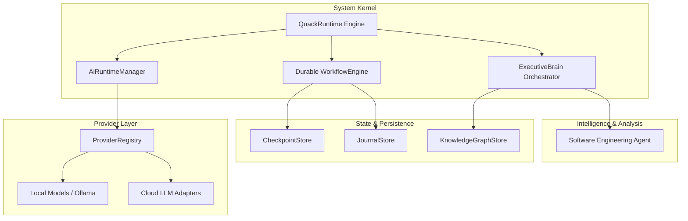

# QUACK OS


**QUACK OS** (Quantum Unified Autonomous Cognitive Kernel) is a local-first AI runtime for orchestrated workflows, policy-gated actions, durable state, and vendor-neutral model providers.

**Production status: v1.0 release candidate.** Core runtime, planner, CapabilityBroker governance, durable recovery, evidence/verification/receipt chain, CLI, skill ecosystem, and provider validation are tested (1516/1516 tests). Verified on Windows (Node 22+) in this release cycle; cross-platform CI validation is pending — see [readiness report](docs/production/PRODUCTION_READINESS_REPORT.md). Missions execute deterministic governed workflows; provider model generation is exercised by provider health checks and the model runtime, not by in-mission reasoning nodes.

## Providers & credentials

QUACK is provider-optional at boot. Providers auto-register when their credential env vars are present (values are read only through the security layer, never logged or exposed):

| Provider | Env var |
| :--- | :--- |
| NVIDIA NIM | `NVIDIA_API_KEY` |
| OpenAI-compatible | `QUACK_OPENAI_API_KEY` (+ `QUACK_OPENAI_BASE_URL`) |
| vLLM | `QUACK_VLLM_BASE_URL` + `QUACK_VLLM_MODEL` |
| Ollama (local) | `QUACK_OLLAMA_BASE_URL` |
| Anthropic | `ANTHROPIC_API_KEY` |

Validate with `quack provider list`, `quack provider doctor`, `quack provider test <id>` — see [provider setup](docs/providers/setup.md).

## Skill security model

Every capability flows through one governed path: `CLI → QuackRuntime → Planner → CapabilityBroker → governed tool execution → evidence → verification → receipt`. External repositories are analyzed statically (never executed), quarantined, and installed only through explicit human approval (`quack skills install` / `enable`). Risk classes are derived from declared requirements, not claims. See [skill ecosystem](docs/skills/ecosystem.md) and [external skill security](docs/security/external-skills.md).

Built on POSIX-inspired operating system design patterns, QUACK OS abstracts prompt engineering, multi-agent state coordination, durable workflow execution, and model divergence behind a unified, resilient system kernel.

---

## ⚡ Install QUACK

Requires Node.js >= 22.5 (npm included). No repository clone, no build step.

```bash
npm install -g @quack/os
```

or the official installer:

| Platform | Command |
| :--- | :--- |
| **Linux / macOS** | `curl -fsSL https://quack.os/install.sh \| bash` |
| **Windows (PowerShell)** | `irm https://quack.os/install.ps1 \| iex` |

Then:

```bash
quack init      # first-run: creates ~/.quack (config/data/logs/skills)
quack doctor    # health check: runtime, storage, recovery, security, skills
quack run "<goal>"   # governed mission execution
```

Full reference: [CLI docs](docs/cli/CLI.md) · [Install guide](docs/install/INSTALL.md)

---

## 🚀 From a repository clone

QUACK OS features an automated bootstrap system. A single launcher validates Node.js versions, installs dependencies, compiles TypeScript assets, executes health diagnostics, and boots the system server. Verified end-to-end on **Windows** this release cycle; **Linux** and **macOS** launchers exist and are exercised in CI (see RELEASE_PROCESS.md) — cross-platform production claims await CI evidence.

### Quick Start (One Command)

| Platform | Command |
| :--- | :--- |
| **Universal (Node.js)** | `node start.js` *(or `npm run launch`)* |
| **Windows** | `start.bat` *(or double-click `start.bat` in File Explorer)* |
| **Linux & macOS** | `./start.sh` |

Once launched, the QUACK OS Desktop Server is immediately available at `http://localhost:3000`.

#### Advanced Execution Flags
```bash
# Start desktop server on a custom port
node start.js serve --port 8080

# Execute an autonomous workflow goal
node start.js "Analyze workspace architecture and generate report"

# Run system health diagnostics
node start.js doctor
```

## Using QUACK Control Room

Start the local server, then open `http://127.0.0.1:3000/dashboard`. QUACK Control
Room exposes Missions, Agents, Models, Actions, Integrations, Browser, Files,
Approvals, Evidence, System, and Settings from the authenticated loopback API.
Provider credentials are never exposed to the browser.

See [QUACK Studio UI](docs/QUACK_STUDIO_UI.md) and [Quickstart](docs/QUICKSTART.md).

---

## 🏢 Platform Architecture

QUACK OS contains separate runtime and intelligence components. The current composition still includes domain-specific dependencies and multiple orchestration paths; architectural extraction is not part of this release preparation.



### Core System Subsystems

1. **Kernel (`QuackRuntime`)**: Core dependency injection, lifecycle management, and security boundary manager.
2. **Executive Brain (`ExecutiveBrain`)**: Cognitive orchestrator that decomposes high-level goals into parallel Directed Acyclic Graphs (DAGs).
3. **AI Runtime Manager (`AIRM`)**: Capability-based model router matching runtime requirements (`requiresTools`, `requiresVision`, latency budgets) to optimal providers.
4. **Software Engineering Agent (`SEA`)**: Software engineering components for code patching, analysis, and validation.
5. **Durable Workflow Engine (`WorkflowEngine`)**: Resilient execution runtime providing automatic retries, timeout boundaries, and JSON-based disk state checkpointing.
6. **Plugin Sandbox (`PluginSandbox`)**: Extension lifecycle and cooperative permission checks; plugins executing in-process are trusted code.
7. **Knowledge Graph & Memory (`KnowledgeGraphStore`)**: Persistent semantic graph engine maintaining long-term repository understanding.

---

## 📁 System Topology

```
src/
├── airm/          # AI Runtime Manager (Capability routing & provider selection)
├── brain/         # Executive Brain (Goal decomposition & DAG delegation)
├── computer/      # Hardware telemetry & OS system integration
├── cos/           # Computer Operating System core abstractions
├── engine/        # Durable Workflow & Session persistence engine
├── events/        # High-throughput EventBus for pub/sub telemetry
├── intelligence/  # AST parsing, code indexing, and semantic search
├── memory/        # Knowledge Graph & episodic memory store
├── organization/  # Multi-agent communication bus & role registry
├── plugins/       # Sandboxed tool & plugin resolution engine
├── providers/     # Vendor-neutral LLM provider adapters
├── runtime/       # Core Kernel initialization & lifecycle hooks
├── sea/           # Software Engineering Agent algorithms
├── security/      # Risk-aware approval policies & access control
└── telemetry/     # Immutable audit logging & performance metrics
```

---

## 🛠️ Developer SDK & Extensibility

QUACK OS provides official extension templates in the `templates/` directory for extending system capabilities without modifying the frozen Kernel.

### Programmatic SDK Integration

```typescript
import { QuackRuntime, ExecutiveBrain } from "@quack/os";

// Initialize the QUACK OS Kernel
const runtime = await QuackRuntime.create({
  workspaceRoot: "./my-project",
  dataDir: "./.quack",
});

// Delegate goals to the Executive Brain
const brain = new ExecutiveBrain(runtime);
await brain.executeGoal("Refactor data layer to use asynchronous stream processing");
```

### Extension Points
- **Provider Adapters**: Implement `QuackProviderV1`, register it without kernel changes, and pass the provider conformance suite. Existing `ProviderAdapter` implementations remain supported through a conservative compatibility bridge.
- **Plugins**: Implement `QuackPlugin` (`templates/plugin-sandbox`) to register custom tools. In-process plugins are trusted code; manifest checks do not provide OS isolation.
- **Workflow DAGs**: Define `TaskGraph` pipelines (`templates/workflow-dag`) for structured multi-step execution.
- **Declarative Skills**: Create YAML skill manifests (`templates/skill-manifest`) to supply domain instructions.

---

## 🔒 Security & Performance Governance

- **Command Injection Safeguards**: All external process invocations undergo strict AST parameter verification.
- **Bounded Memory Infrastructure**: All runtime state maps and event buffers utilize LRU/TTL constraints to prevent memory leaks during long-running tasks.
- **Immutable Audit Chain**: System activities and code modifications are written to an append-only telemetry audit store.
- **Continuous Benchmarking**: Core operations are benchmarked to guarantee event-loop blocking stays under 15ms per tick.

---

## 📄 License

This project is licensed under the MIT License. See LICENSE for details.
