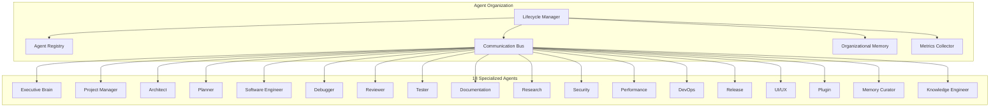

# Agent Organization Diagram

```mermaid
graph TD
    subgraph "Agent Organization"
        LM[Lifecycle Manager]
        REG[Agent Registry]
        BUS[Communication Bus]
        OM[Organizational Memory]
        MET[Metrics Collector]

        LM --> REG
        LM --> BUS
        LM --> OM
        LM --> MET
    end

    subgraph "18 Specialized Agents"
        AG1[Executive Brain]
        AG2[Project Manager]
        AG3[Architect]
        AG4[Planner]
        AG5[Software Engineer]
        AG6[Debugger]
        AG7[Reviewer]
        AG8[Tester]
        AG9[Documentation]
        AG10[Research]
        AG11[Security]
        AG12[Performance]
        AG13[DevOps]
        AG14[Release]
        AG15[UI/UX]
        AG16[Plugin]
        AG17[Memory Curator]
        AG18[Knowledge Engineer]
    end

    BUS --> AG1
    BUS --> AG2
    BUS --> AG3
    BUS --> AG4
    BUS --> AG5
    BUS --> AG6
    BUS --> AG7
    BUS --> AG8
    BUS --> AG9
    BUS --> AG10
    BUS --> AG11
    BUS --> AG12
    BUS --> AG13
    BUS --> AG14
    BUS --> AG15
    BUS --> AG16
    BUS --> AG17
    BUS --> AG18
```
