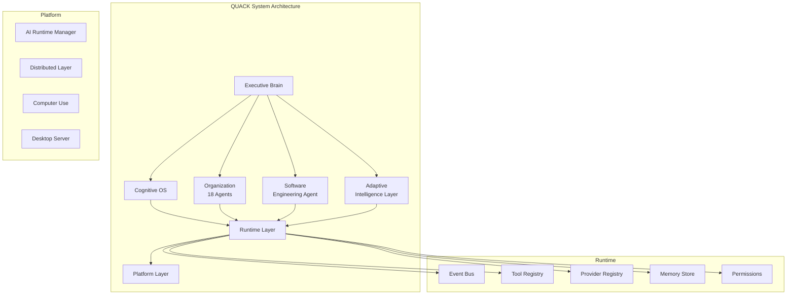

# Architecture Diagram

```mermaid
graph TB
    subgraph "QUACK System Architecture"
        EB[Executive Brain]
        COS[Cognitive OS]
        ORG[Organization<br/>18 Agents]
        SEA[Software<br/>Engineering Agent]
        ADAPT[Adaptive<br/>Intelligence Layer]
        RUNTIME[Runtime Layer]
        PLATFORM[Platform Layer]

        EB --> COS
        EB --> ORG
        EB --> SEA
        EB --> ADAPT
        COS --> RUNTIME
        ORG --> RUNTIME
        SEA --> RUNTIME
        ADAPT --> RUNTIME
        RUNTIME --> PLATFORM
    end

    subgraph "Runtime"
        EVT[Event Bus]
        TOOL[Tool Registry]
        PROV[Provider Registry]
        MEM[Memory Store]
        AUTH[Permissions]
    end

    subgraph "Platform"
        AIRM[AI Runtime Manager]
        DNPL[Distributed Layer]
        UCP[Computer Use]
        DTOP[Desktop Server]
    end

    RUNTIME --> EVT
    RUNTIME --> TOOL
    RUNTIME --> PROV
    RUNTIME --> MEM
    RUNTIME --> AUTH
```
