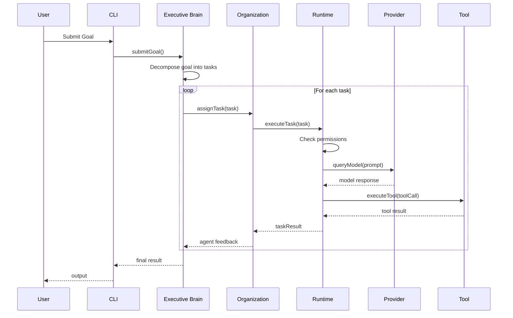

# Data Flow Diagram

```mermaid
sequenceDiagram
    participant User
    participant CLI
    participant Brain as Executive Brain
    participant Org as Organization
    participant Runtime
    participant Provider
    participant Tool

    User->>CLI: Submit Goal
    CLI->>Brain: submitGoal()
    Brain->>Brain: Decompose goal into tasks
    loop For each task
        Brain->>Org: assignTask(task)
        Org->>Runtime: executeTask(task)
        Runtime->>Runtime: Check permissions
        Runtime->>Provider: queryModel(prompt)
        Provider-->>Runtime: model response
        Runtime->>Tool: executeTool(toolCall)
        Tool-->>Runtime: tool result
        Runtime-->>Org: taskResult
        Org-->>Brain: agent feedback
    end
    Brain-->>CLI: final result
    CLI-->>User: output
```
