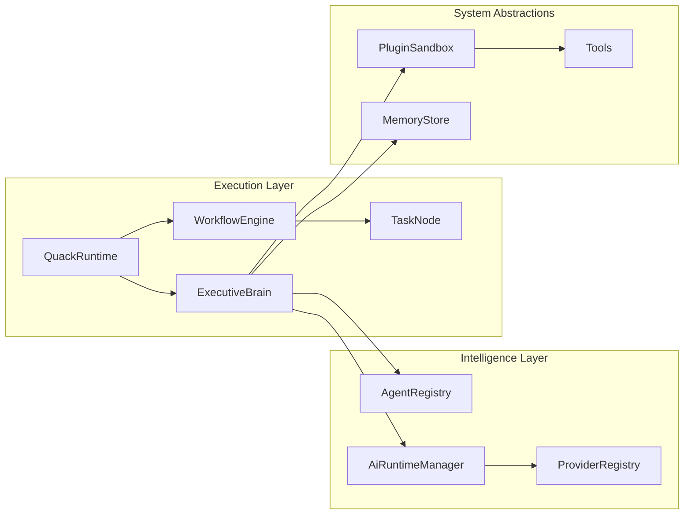

# QUACK OS Architecture

QUACK OS is designed as an Event-Driven AI Operating System. This document outlines the physical and logical architecture.

## Logical Architecture

## Guiding Principles

1. **Provider separation**: Provider and routing abstractions exist, but the current composition still has domain dependencies and multiple model/execution paths.
2. **Observable execution**: The `EventBus` carries execution events. Workflow, mission, session, and loop state currently have separate owners; no single durable execution path is established.
3. **Capability checks**: Registered tool paths enforce their configured permissions and scopes. `WorkspaceManager` is a workspace registry, and `PluginSandbox` validates permission declarations; neither provides OS isolation for arbitrary code.
4. **Resource bounds**: Some components provide budgets or cache limits. Coverage is not universal, and no memory-leak-free or infinite-uptime guarantee is made.

## Core Modules
- **Kernel (`src/runtime/`)**: Bootstraps the DI container, parses config, and mounts the filesystem.
- **AIRM (`src/airm/`)**: Resolves AI routing dynamically. Maps requirements (e.g., `requiresVision: true`) to the cheapest/fastest compatible model on the host or cloud.
- **ExecutiveBrain (`src/brain/`)**: Decomposes user goals into sub-tasks (DAGs) and delegates to agents.
- **SEA (`src/sea/`)**: A specialized agent subclass containing complex algorithms for AST parsing, multi-file refactoring, and test intelligence.
- **WorkflowEngine (`src/engine/`)**: Executes DAGs. Checkpoints state to `JsonFileCheckpointStore`. Supports node timeouts, retry backoffs, and suspension.
