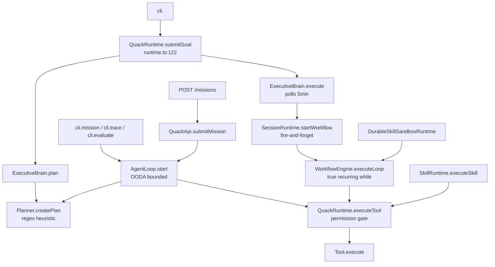

# QUACK Execution Architecture Audit

Status: **BRUTAL — production hardening baseline**
Audited: 2026-08-16
Scope: every component participating in mission lifecycle, executive loop, capability harness, persistence, recovery, and observability.
Method: read source end-to-end, not `PROJECT_STATE.md` summaries.

This audit grounds the canonical contract specs that follow. It is descriptive of *what the code does today* and flags each gap as **MIGRATION REQUIRED** rather than papering over it.

---

## 1. The Flow As Documented vs As Implemented

### Documented flow (PROJECT_STATE.md:23)

```text
Mission → Planner → Workforce Router → Skill Registry → Task Graph
       → Tool Runtime → Verification → Evidence → Memory → Learning
```

### Actual call graph (per entry point)



**Three competing "executive loops"** drive autonomous execution depending on entry point:

| Driver | File:line | Used by | Recurring? |
|---|---|---|---|
| `QuackRuntime.submitGoal` | runtime/runtime.ts:122 | `cli <goal>` default command | No — single plan→execute |
| `AgentLoop.start` | agent-loop/index.ts:167 | `QuackApi.submitMission`, CLI `mission`/`trace`/`evaluate`, HTTP `POST /missions` | Bounded `for index=1..maxIterations` (default 3) |
| `WorkflowEngine.executeLoop` | engine/workflow-engine.ts:133 | `ExecutiveBrain.execute`, `DurableSkillSandboxRuntime`, `SessionRuntime.startWorkflow` | Yes — `while (!cancelled && !isComplete())` with `await delay(50)` |

The `ExecutiveBrain.execute` path polls `WorkflowEngine` to completion via `pollWorkflowCompletion` (executive-brain.ts:388-400) — a **5-minute poll loop with `setTimeout(200)` sleeps**, not a notified completion. **MIGRATION REQUIRED**: single canonical loop.

All three paths converge on `QuackRuntime.executeTool` (runtime/runtime.ts:320) for capability/permission gating; see §6.

---

## 2. Mission, Task, and Loop State Today

### Mission (soft)

`MissionDefinition.status` (cos/types.ts:50) is `"draft" | "active" | "completed" | "failed"`. `MissionManager` (cos/mission-manager.ts:12-77) does each transition with only `!==X` pre-checks. No `assertState`, no transition matrix, no illegal-transition failure.

### Task (soft)

`TaskStatus` (runtime/task.ts:5) = `"created" | "planned" | "running" | "completed" | "failed"`. Transitions are sprinkled ad-hoc across `QuackRuntime.submitGoal` (runtime.ts:132, 167, 170, 195, 211). No state machine object owns this.

### AgentLoop (soft, in-memory only)

`AgentLoopState` (agent-loop/index.ts:12) = `IDLE | OBSERVING | PLANNING | EXECUTING | VERIFYING | REFLECTING | COMPLETED | FAILED`. Held on the `AgentLoop` instance field `state`. **Not persisted, not per-mission** — see §10 concurrency.

### Mission Company (HARD — the only enforced FSM)

`src/company/runtime.ts:240-252` enforces `PLANNED → FORMING → READY → (WAITING | RUNNING) → VERIFYING → DORMANT(outcome)` with `requireRecord` and per-state `if (current.state !== X) throw`. `reconcileInterrupted()` is the *only* startup recovery and it forcibly DORMANT-FAILs every non-terminal company (conservative; correct under absence of side-effect reconciliation).

**Three overlapping units (Mission, Task, Mission Company), three different state models.** **MIGRATION REQUIRED**: unify under one canonical.local state machine (see `MISSION_STATE_MACHINE.md`).

---

## 3. Planner / Engine

### Planner is deterministic, not LLM

`engine/planner.ts:116 buildGraph` regex-matches the goal string and emits a hardcoded 7-node analyze→context→plan→execute→(secondary)→validate→test→verify graph (or a single-node workspace-listing graph for `list|show|inspect` + `workspace|files?|repo`). `decomposeGoal` (planner.ts:42-74), `estimateRisk`, `estimateCost`, `identifyRequiredPermissions` are all static heuristics. Model selection only writes a metadata field (planner.ts:383-395). **The "plan" driving autonomous execution is deterministic regardless of LLM provider.** This is fine for a bootstrap but must be called out: the loop cannot currently reason its way out of a situation the regex does not anticipate.

`create-system.ts:571` wires the planner with `defaultRetryPolicy: { maxRetries: 1, backoff: "fixed", baseDelayMs: 100, maxDelayMs: 1000 }`, `defaultTimeoutMs: 30_000`, `maxNodesPerGraph: 20`. Note `maxRetries: 1` here is more conservative than `ExecutiveBrain`'s default 3 (executive-brain.ts:51).

### WorkflowEngine is the only true recurring loop (non-API)

`engine/workflow-engine.ts:493`.

| Element | line | Notes |
|---|---|---|
| `executeLoop` | 133 | `while (!cancelled && !isComplete())`. Per iteration: checkpoint interval check (141-152), enqueue ready nodes (155-162), dequeue + execute (164-169), iterate timeouts (172-185), skip blocked (187), `await delay(50)` (189). |
| `executeNode` | 206 | Per-node `setTimeout` timeout guard (210-216), `executeNodeWork`, `reflectionEngine.reflect` (226), then retry/escalate/complete. |
| `executeNodeWork` | 270 | Iterates `node.toolInvocations` **sequentially** — parallelism is across nodes via scheduler, not within a node. Validates `toolId ∈ requiredTools` (302-310). `$fromNode` JSON binding resolution (359-422). |
| `cancel` / `pause` / `resume` | 82-100 | Clears per-node timers and the interval handle. |
| Mutable instance state | 27-28 | `intervalHandle`, `nodeTimers`. |

### Session / checkpoint / journal

- `engine/session-runtime.ts`: sessions Map; undo/redo stack holds **session metadata only, not workflow node results**. With `storageDir`, per-session JSON files for journal + checkpoint. LRU-evicts past `maxActiveSessions ≈ 1000` (line 42). `startWorkflow` (89) instantiates a fresh `WorkflowEngine` per workflow — **fire-and-forget** (`void loopPromise` at workflow-engine.ts:78).
- `engine/checkpoint-system.ts:99 CheckpointManager`: `create` prunes old checkpoints (`maxCheckpointsPerWorkflow=10`), monotonic `metadata.index`. `restore(checkpointId)` (line 135) returns a snapshot — **no production caller**.
- `engine/execution-journal.ts`: append-only. `replay(workflowId)` exists (line 30) — **no production caller**.
- `engine/recovery-engine.ts:104`: backoff calculator (fixed/linear/exponential/jitter-full). `buildRecoveryPlan` classifies `transient|permanent|unknown` from substring match on error messages (85-92). `findRollbackTargets` hardcoded to `[node.id]` (95-97) — **single-node rollback only, no cross-node compensation, no side-effect probe**.
- `engine/scheduler.ts:101`: priority queue + bounded running set (`maxParallelNodes`: 4 SEA; 3 ExecutiveBrain). **No backpressure — `enqueue` always pushes; `dequeue` returns `undefined` when at capacity.**
- `engine/reflection-engine.ts`: `reflect()` returns `verdict`, `requiresRetry`, `requiresEscalation`, `confidence` (decreases `0.1 * retryCount`).

### How a plan actually gets executed

| Path | Description |
|---|---|
| `QuackRuntime.submitGoal` | `Brain.plan` → `Brain.execute` → `SessionRuntime.startWorkflow` → new `WorkflowEngine` → background `executeLoop` while brain blocks on `pollWorkflowCompletion(engine, 300000)` (5-min `setTimeout(200)` poll). |
| `AgentLoop` | same `Planner.createPlan`, then `selectAction(plan)` returns the **first** graph node carrying `toolInvocations` (often the only concrete one). Rest of the graph runs in name only. **MIGRATION REQUIRED**: walk the full task graph or replace planner output with a single executable action per iteration. |

---

## 4. Tools

`src/tools/tool.ts:147`. `QuackTool` interface (line 51), `ToolRegistry` (76), `validateToolInput` (58).

Registered tools (`create-system.ts:207-214`): `EchoTool`, `WorkspaceListFilesTool`, `WorkspaceReadFileTool`, `WorkspaceWriteFileTool`, `CodeSearchTool`, `TerminalTool` (`child_process.execSync` @ terminal.ts:114 — **blocking, uncancellable**), `GitStatusTool` (`execSync`), `AgentReachTool` (uses `AbortController` + `setTimeout`, agent-reach.ts:69-72).

### `executeTool` (runtime.ts:320-383) — the heart of permission gating

1. Company identity resolution (325-335).
2. Tool lookup.
3. `validateToolInput` (339).
4. **For each permission in `tool.describe().permissions` (342-363)**: build a `CapabilityRequest` via `buildToolCapabilityRequest`, call `requestCapability`, short-circuit on the first denial → `CapabilityDeniedError`.
5. Emit `tool.requested` (365).
6. `await tool.execute(input, {taskId, actor})` (368).
7. Emit `tool.completed` (369, 380).

All executive paths converge here:
- `AgentLoop.executeAction` → `deps.executeTool` = `runtime.executeTool` (create-system.ts:581).
- `WorkflowEngine.executeNodeWork` → `config.executeTool` = `runtime.executeToolInvocation` → `runtime.executeTool` (executive-brain.ts:144, runtime.ts:110-119).
- `SkillRuntime` → `deps.executeTool` = `runtime.executeTool` (create-system.ts:599).

### Gaps

- **No `AbortSignal` parameter on `executeTool`.** Tools that use `execSync` (TerminalTool, GitStatusTool) are uncancellable by design. `AgentLoop.stop()` sets a flag but does not abort an in-flight `executeTool`.
- **No idempotency key on `executeTool`.** A retried tool call with side effects (filesystem write, terminal exec) is a duplicate side effect. Only `actions/runtime.ts` has idempotency keys (§10).
- **No timeout on `executeTool` itself.** Timeout lives at the loop level (`AgentLoop.withTimeout` wraps the iteration; WorkflowEngine per-node `setTimeout`). A tool that hangs past those is only killed by the wrapper race — and only the call site, not the tool.

---

## 5. Skills

| File | Role |
|---|---|
| `skills/registry.ts` | `SkillRegistry` with JSON-backed store (create-system.ts:345). |
| `skills/compiler.ts`, `skills/validator.ts` | Plugin validation + fingerprinting. |
| `skills/executor.ts` | Dispatches to sandbox (portableExecution branch) or `definition.execute(input)` (executor.ts:53). |
| `skills/sandbox-runtime.ts` | `DurableSkillSandboxRuntime` wraps skills in a `WorkflowEngine` with `NO_RETRY`, bounded `SkillSandboxPolicy` (maxSteps=8, maxToolCalls=12, maxRetriesPerStep=1, timeoutMs=5000, maxPollMs=10000). |
| `skills/runtime/index.ts:490` | `SkillRuntime` preflight `capabilityBroker.resolve` for every required permission (345-369). `executeSkill` (160) wraps sandbox. |
| `skills/packages/index.ts` | `SkillPackageManager` JSON-backed store. |

### How skills execute tools

Always through `runtime.executeTool`:
- `create-system.ts:328-340` — `SkillExecutor.executeTool` bound to `runtime.executeTool`.
- `create-system.ts:595-603` — `SkillRuntime.executeTool` bound to `runtime.executeTool`.
- `skills/runtime/index.ts:209-224` — `DurableSkillSandboxRuntime` first checks `manifest.allowedTools.includes(invocation.toolId)` (client-side), then calls `this.deps.executeTool`.

### Do skills bypass the harness?

**No.** Every skill tool invocation routes through `QuackRuntime.executeTool` which enforces capability/permission gating. Defense in depth: manifest validation at registration (291-293), client-side allowlist check (210-212), broker authorization at execute (345-369). The client-side allowed-tools check is itself a soft check — the broker still authorizes. The schema validator still rejects misdeclared manifests at load time.

### Gaps

- Skill package **signing, remote package repositories, dependency resolution, package test execution** are not implemented (PROJECT_STATE.md:95). An uploaded manifest with `allowedTools` widened at install would still be capability-checked at execute, but trust-on-install is weak.
- Skills are loaded/validated once at registry load and never re-validated at execute (other than the per-execute allowlist + capability broker pass). A patched-later manifest file is a trust drift risk.

---

## 6. Security / Permission / Capability

### `security/approval-controller.ts:114`

`RiskLevel = "low" | "medium" | "high"` (5). `RiskAwareApprovalPolicy.decide` (65):
- `permission ∉ allowList` ⇒ deny;
- `LOW_RISK` + `autoApproveLow` ⇒ allow;
- medium/high with no approver ⇒ **DENY** (fails closed);
- otherwise call approver.

HIGH_RISK set (36-46): `filesystem.write.external`, `git.write`, `secrets.write`, `plugin.install`, `terminal.execute`, `browser.control`, `mcp.execute`, `external.write`, `email.send`.
LOW_RISK set (48-54): `workspace.read`, `filesystem.read.external`, `git.read`, `memory.read`, `memory.write`.

Default behavior with no approver is the safe one — medium/high-risk actions denied. Good.

### `security/capability-broker.ts:570`

`PermissionBackedCapabilityBroker.resolve` (124):
- no `request.permission` ⇒ deny;
- validate `permission ↔ capability ↔ resource-kind` round-trip;
- if `missionId` is provided but no matching active grant ⇒ deny;
- otherwise delegate to `permissions.decide` and re-pack with grant id.

`classifyPermissionAction` (359) returns `READ | REVERSIBLE_CHANGE | IRREVERSIBLE_ACTION` — the unified classifier the prompt asks for **already exists** but is only used for audit context, not as the gating runtime contract. **MIGRATION REQUIRED**: promote this classification to the canonical action-risk dimension (see `SAFETY_AND_PERMISSION_MODEL.md`).

`InMemoryCapabilityGrantRegistry` (192), `JsonFileCapabilityGrantRegistry` (268) with 5-attempt `renameWithTransientRetry` for `EPERM|EBUSY|EACCES` using `Atomics.wait` sleep (303-311).

`security/network-policy.ts`: `NetworkPolicyEngine` (3 default rules: ollama-loopback, nvidia-api, browser-allowlist). `fetch()` wraps `fetch`, audits each decision to `storage.memory`, default-deny when no rule matches. Good design — but tool execution has no analogous network-side gate (tools can do anything `QuackTool.execute` does).

### Denial surface

`QuackRuntime` returns a structured `QuackError`:
- `code: "tool.permission_denied"` (runtime.ts:442-462);
- `context.errorType: "CapabilityDeniedError"`;
- `context.{missionId, toolId, capabilityId, missingPermission, reason, policyRef, grantId}`.

Events `capability.denied` (runtime.ts:307), `permission.decided` (300). `AgentLoop` short-circuits on `capabilityDenied` (index.ts:442) and `reflect()` returns `"fail"` (no retry). Good.

### Gaps

- **Authorization lives inside `executeTool`, not as an explicit loop phase.** The "DECIDE → AUTHORIZE → ACT" boundary the prompt asks for is implicit — the model/planner proposes a graph, the loop picks the first node, the loop calls `executeTool`, and only at that boundary is authorization checked. There is no point in the loop where the *proposed action* itself is authorized before the loop commits to executing it.
- **`POST /missions/{id}/cancel` does not exist** (confirmed: no `cancel` route in `src/server/`; grep returns only the test file `server.test.ts:249` which is `ReadableStream.cancel`). There is no external cancellation API today. `ApiMissionRecord.state` (server/index.ts:36) is `"QUEUED" | "RUNNING" | "COMPLETED" | "FAILED"` — no `CANCELLED`, no `TIMED_OUT`, no `INTERRUPTED`.
- Permission names are a closed union (`src/security/permissions.ts`). External policy loading is not implemented (PROJECT_STATE.md:88).

---

## 7. Providers / Models

- `providers/provider.ts:115` — `ProviderRegistry` Map. `EchoProvider`.
- `providers/openai.ts` — `OpenAiCompatibleProvider`, `createOllamaProvider`, `createVllmProvider`. All network calls use `fetch` + `AbortSignal.timeout` (lines 41, 62, 94).
- `providers/nvidia.ts` — `NvidiaNimProvider` with injected `fetch` via `networkPolicy.fetch`. `AbortSignal.timeout` (40, 70, 104).
- `providers/router.ts` — `ProviderFallbackRouter`. **NOT on the looping tool-execution path.**
- `providers/kernel.ts:418` — `CanonicalProviderRegistry` + `CapabilityProviderRouter` (116). Route loop (146): nested `for candidateIndex`, `for attempt`; exponential-jitter backoff. **The only circuit breaker in the codebase** (117 `circuits: Map`, 266-287): 3 failures ⇒ open 30s, success resets.
- `providers/legacy-adapter.ts` — `LegacyProviderV1Bridge` wraps v0 providers as capability providers.
- `models/runtime.ts` — `ModelProvider`, `OllamaModelProvider`, `OpenAICompatibleModelProvider`, `ModelRuntimeRouter`, `ModelRuntime`. All network calls `AbortSignal.timeout` (82, 106, 144, 203, 226, 263).

### Provider-specific branching in the loop?

**No.** `ExecutiveBrain` chooses providers by id and uses `buildProviderProfiles()` (313-338) only for `CostOptimizer` lookups, not active routing in the default path. The model/loop boundary is clean — but the planner is deterministic so the model has no actual routing authority today.

---

## 8. Storage / Persistence — `src/storage/sqlite.ts:505`

Uses Node 22+ `node:sqlite` via `createRequire`. `SqliteConnection.withDatabase` (112): **opens a new `DatabaseSync` for every operation**, runs `pragma busy_timeout = 10000` + `runMigrations`, closes (118-121). **No connection pool.**

Writes appear at:
`SqliteMissionCompanyRepository.save` (74), `SqliteMissionRepository.save/get/list/clear` (126-153), `SqliteTaskStore.save` (159), `SqliteTraceRepository.save` (205), `SqliteEvaluationRepository.save` (234), `SqliteMemoryStore.write` (287), `SqliteMemoryStorageAdapter.save` (310), `SqliteActionExecutionLedger.save/get/findByIdempotency/listAmbiguous` (324-365).

3 idempotent migrations (`IF NOT EXISTS`, tracked in `quack_migrations` table).

`CompositeTaskStore` (sqlite.ts:181) writes to SQLite primary + JSON mirror in parallel (create-system.ts:553).

### What is persisted vs rehydrated on startup

| Entity | Persisted | Rehydrated at startup? |
|---|---|---|
| `MissionDefinition` | SQLite `missions` | No — lazy via `missionManager.get` |
| `Task` | SQLite `tasks` + JSON mirror | No |
| `MissionTrace` | SQLite `traces` | No |
| `StoredMissionEvaluation` | SQLite `evaluations` | No |
| `MemoryRecord` | SQLite `memory_records` | No |
| `MemoryItem` | SQLite `memory_items` | No |
| `ActionExecutionRecord` | SQLite `action_execution_ledger` | **YES** by idempotency-key re-submit (only) |
| `MissionCompanyRecordV1` | SQLite `mission_companies` | **YES** via `reconcileInterrupted` at `cli.ts:335` & `server/index.ts:72` |
| Capability grants | JSON file | **YES** eagerly in `JsonFileCapabilityGrantRegistry` constructor (269) |
| Skill registry snapshot | JSON file | **YES** at `skillRegistryStore.load()` (create-system.ts:346) |
| Evidence experiences | JSON file | No (lazy `list`) |
| Self-modification experiments | JSON file | No |
| Improvement cycle state | JSON file | No |
| Skill package metadata | JSON file | No |
| Audit log (events) | JSONL file | No |

### Startup recovery today

Only `companyRuntime.reconcileInterrupted()`. Force-FAILs every non-DORMANT company. `selfmod/code-improvement-controller.ts:191 recoverInProgress()` exists — **never called from production code** (only from `promotion.integration.test.ts:328`). `CheckpointManager.restore()` and `Journal.replay()` exist with **no production caller**. **MIGRATION REQUIRED**: a startup recovery loop that classifies interrupted missions (see `RECOVERY_MODEL.md`).

### JSON file write amplification

Several stores use whole-file rewrite on every save:
- `telemetry/audit-log.ts:26-31` — events JSONL: `readRaw + append + write` per event.
- `engine/checkpoint-system.ts:94 JsonFileCheckpointStore` — `atomicWriteFile` whole-file rewrite.
- `JsonFileCapabilityGrantRegistry` — temp-file + rename (good).
- `JsonFileEvidenceExperienceStore`, `JsonFileSkillRegistryStore`, `JsonFileSkillPackageStore` — `atomicWriteFile`.

For sustained event throughput the JSONL write-per-event is the binding constraint. **MIGRATION REQUIRED**: batching journal (`RECOVERY_MODEL.md`).

---

## 9. Events — `src/events/event-bus.ts:170`

`QuackEvent` (106): `{id, type: QuackEventType, timestamp, taskId?, actor, payload}`. **No explicit `correlationId` or `causationId`** — `taskId` doubles as correlation within a mission. Every event has random `createId("event")` (144) — no monotonic counter.

`QuackEventType` (4-103) is a closed discriminated union of ~95 types. New event types require source change. **Modules in `src/sea/*` escape via `as any` casts** (`sea/sea.ts:160`, `sea/editing/editing-workflow.ts:73`) to emit events whose string `type` is not in the union — bypassing the type system. **MIGRATION REQUIRED**: open the event type via a registered event namespace or remove the casts.

Sinks:
- `auditLog` JSONL (`create-system.ts:261` wires `events.onAny((event) => auditLog.append(event))`). Durable, throughput-bound by whole-file rewrite (§8).
- HTTP server keeps last 500 events in memory (server/index.ts:91-94) and exposes them via SSE `/events` (632-648).

`EventBus.drain()` (164-168) waits `pendingEmits`. CLI SIGINT handler (`cli.ts:370-377`) **does not await `events.drain()`** — clean shutdown risks losing in-flight events. **MIGRATION REQUIRED**.

---

## 10. Recovery (three subsystems, only one functional)

1. **`src/recovery/`** — file-tree backup/restore (`quack backup`/`quack restore` CLI). NOT on any mission-execution path.
2. **`src/engine/recovery-engine.ts`** — per-node backoff calculator and retry/escalate classifier inside `WorkflowEngine.executeNode`. Retries the same node only, possibly with `retry_different_tool`, no equivalence probe. `findRollbackTargets` hardcoded to `[node.id]` (95-97) — single-node scope, no cross-node compensation, no side-effect probe.
3. **`src/engine/checkpoint-system.ts` + `execution-journal.ts`** — `restore()` and `replay()` exist with **no production caller**.
4. **Action-level reconciliation (the only substantive recovery subsystem):** `src/actions/runtime.ts` + `actions/ledger.ts`.
   - Action state machine (ledger.ts:5-14): `PLANNED | AWAITING_APPROVAL | APPROVED | EXECUTING | SUCCEEDED | FAILED | UNKNOWN_EXTERNAL_STATE | RECONCILING | CANCELLED`.
   - Ambiguous states (ledger.ts:104-106): `EXECUTING | UNKNOWN_EXTERNAL_STATE | RECONCILING`.
   - On crash mid-action with side-effect, row stays `EXECUTING`. Next request with the **same idempotency key** triggers `ActionRuntime.execute` (runtime.ts:122-133) → `recoverExisting` (201-239):
     1. `SUCCEEDED` cached ⇒ return cached result.
     2. `provider.reconcile` exists ⇒ provider decides.
     3. else row stays `UNKNOWN_EXTERNAL_STATE`, `reconciliationState = "BLOCKED_PROVIDER_UNSUPPORTED"`, action `FAILED`.
   - `ActionProviderV1.reconcile?` is a per-action provider v-table method.
   - Server `/actions` surfaces ambiguous executions (server/index.ts:776-782).

### Critical recovery gaps

- **Side-effect reconciliation only fires when caller re-submits the same idempotency key.** There is **no startup scan of `listAmbiguous()` and reconciliation**. Ambiguous rows persist silently until someone reuses the key. **MIGRATION REQUIRED**: startup reconciliation worker (`RECOVERY_MODEL.md`).
- **No workflow-node resume.** A `WorkflowEngine` interrupted by process death has no resume path. The persisted checkpoint is orphaned.
- **No mission-level recovery at all on the `AgentLoop` path** — `AgentLoop.iterations` is an in-memory array on the instance.

---

## 11. Observability / Telemetry

| Subsystem | File:line | Notes |
|---|---|---|
| Structured events | `events/event-bus.ts:106` | typed but uncorrelated (no `correlationId`/`causationId`) |
| Event persistence | `telemetry/audit-log.ts:23` | whole-file JSONL rewrite per event |
| Local event buffer | `server/index.ts:91-94` | last 500 in `QuackHttpServer.events` |
| SSE stream | `server/index.ts:632-648` | `/events` |
| Trace capture | `harness/trace-recorder.ts:17` | `attach()` via `onAny`; `createTrace` (43) serializes `MissionTrace`, persists via `traceRepository.save` |
| Trace persistence | `storage/sqlite.ts:202-229` | keyed by `id` + `lookup_id` (loopId on the server side) |
| Trace evaluation | `harness/evaluator.ts` | synchronous `evaluateMission(trace)` + event-emitting `MissionEvaluator.evaluateMission(trace)` |
| Metrics | `harness/metrics-collector.ts:9` | `collectMetrics(trace)` → `HarnessMetrics { taskSuccessRate, toolFailureRate, capabilityViolations, recoveryAttempts, executionLatencyMs, iterationCount, toolCallCount, capabilityCheckCount }`. **Post-hoc per-trace, no time-series, no histogram.** |
| Compile-time replay | `harness/replay-engine.ts` | present; not used in audit-cycle production flow |
| `src/observability/` | **empty directory** | nothing here |
| **OpenTelemetry / `@opentelemetry` / prom-client** | grep returns zero matches | — |

### Gaps

- No OpenTelemetry spans anywhere. Traces are an internal JSON snapshot, never OTLP.
- Structured logging IS the JSONL audit log — nothing else.
- Metrics derived post-hoc from each completed trace — no telemetry stream of in-progress mission progress. `/dashboard/state` queries live traces from SQLite.
- `QuackEventType` is a closed discrimination union; `sea/*` emits out-of-union events via `as any` (§9).
- No structured log correlation across `missionId` / `runId` / `iterationId` / `actionId` / `providerId` — `taskId` is the only correlation id in use.

**MIGRATION REQUIRED**: full `OBSERVABILITY.md`.

---

## 12. Self-Modification — `src/selfmod/`

`code-improvement-controller.ts:877` orchestrates the full gated pipeline:
`queueProposal → AWAITING_HUMAN → recordHumanDecision → materializeApprovedProposal → proposeChange → WORKTREE_CREATED/PATCHED/VERIFYING/AWAITING_HUMAN → recordHumanDecision → promote`.

**Never directly mutates production code by itself.** Crossing into the real branch requires `promote(experimentId, {actor})` (409) which re-validates approval + fingerprint + protected-core classification + base-commit-staleness, then `git merge --no-ff`; post-merge verification; auto-revert via `git revert --no-edit -m 1` on regression (534). If the revert itself fails: leaves the merge in place, flags `rollbackReason = "manual intervention required"` (ponytail: automatic revert-of-revert not implemented, line 538).

Gates:
- Human approval gate: `recordHumanDecision` (326, plus reserved-actor rejection).
- Protected-core gate at `queueProposal` (216), `proposeChange` (268), `promote` (423) — three layers.
- Fingerprint match at `recordHumanDecision` (line 350) and at `promote` (line 428).
- Reserved actor set (45): `["", "selfmod", "evaluator", "scheduler", "candidate", "system", "controller", "quack", "autonomous"]` — these actors cannot approve a self-modification proposal.

`integrity-checker.ts` — `checkTestIntegrity(patch)` flags patches that delete/mangle test files.
`protected-core-policy.ts` — rejects `security | selfmod | engine | runtime | tool | …` reaches from queue + propose + promote.
`worktree-manager.ts` — `GitWorktreeManager` uses `toolExecute` (NOT `child_process`) — comment lines 19-21.

### Does self-modification trigger from inside the loop?

Yes, but only to *propose*: `QuackRuntime.submitGoal` ends with `improvementCoordinator.onMissionCompleted` (runtime.ts:228-246) if configured and origin `!== "improvement"` (the origin guard at runtime.ts:80-82). `AgentLoop.start` similarly (create-system.ts:585-589, agent-loop/index.ts:230-245).

Proposals can originate from autonomous improvement loops (via `ImprovementProposalBridge`), but materialization + promotion require explicit external human action. **This boundary is sound.**

### Gaps

- `recoverInProgress()` (191) is not called from any production startup path — only from a test (`promotion.integration.test.ts:328`). An interrupted promotion (after `git merge --no-ff`, before post-merge verification) leaves the worktree in an inconsistent state until a human intervenes. **MIGRATION REQUIRED**: wire `recoverInProgress()` into the startup recovery loop.

---

## 13. Server / API

### `src/server/index.ts:998` — `QuackHttpServer`

| Route | Method | Line | Notes |
|---|---|---|---|
| `/missions` | POST | 152 | body `{goal, missionId?, actor?, mode?, providerId?, model?, safetyMode?, dryRun?}`. Returns 202. Internally `runMission` (318) → `system.api.submitMission`. |
| `/missions` | GET | 156 | Lists both HTTP-run missions AND `cognitiveSystem.missionManager.getAll()` |
| `/missions/{id}/status` | GET | 160 | `ApiMissionRecord.state` ∈ `QUEUED|RUNNING|COMPLETED|FAILED` IF HTTP-run; falls through to `system.api.getStatus(id)` |
| `/missions/{id}/events` | GET | 164 | Buffered events for that mission |
| `/missions/{id}` | GET | 168 | Full record + detail `{trace, evaluation, tasks, evidence, events}` |
| `/missions/{id}/cancel` | POST | — | **DOES NOT EXIST** |
| `/traces/{id}` | GET | 172 | Looks up by `id` OR `lookup_id` (loopId) |
| `/skills/import` `/skills/{id}/enable` `/skills/{id}/disable` `/skills` | POST/GET | 176-188 | |
| `/improvement/proposals` `/approve` `/reject` `/{id}` | GET/POST | 192-204 | Requires `confirm:true, actor!=""`. Routes to `recordPendingProposalDecision`. |
| `/recipes` `/{id}/plan` `/{id}` | GET/POST | 208-216 | Search returns metadata-only (line 506) |
| `/providers` `/providers/test` | GET/POST | 220-224 | Health probe; credentials never returned |
| `/actions` | GET | 228 | Shows `ambiguous` subset separately (779) |
| `/mcp` | GET | 232 | MCP server metadata list |
| `/system/status` | GET | 236 | Includes action ambiguity counts |
| `/memory` | GET | 240 | Read-only memory dump |
| `/settings` | GET/PATCH | 244-248 | Only improvement config patchable; self-mod approval-required bit cannot be disabled (624-627) |
| `/agents` | GET | 252 | Workforce registry |
| `/health` | GET | 256 | Public (895) |
| `/events` | GET | 276 | SSE stream |
| `/dashboard` `/styles.css` `/app.js` `/state` | GET | 260-272 | Studio UI |

### accepted/running/completed/failed distinction

Yes — `ApiMissionRecord.state` enum (`server/index.ts:36`) = `QUEUED | RUNNING | COMPLETED | FAILED`. **BUT there is no queued waiting state**: the server runs the mission inline within the request lifetime; `QUEUED` only exists between record creation and `runMission` start, both inside the same `createMission` handler. The HTTP response is 202 to the client, but inside the request the call is synchronous. A mission that takes 30 minutes keeps the request alive 30 minutes. **MIGRATION REQUIRED**: actual queue with workers (see `OBSERVABILITY.md` + backpressure spec).

### Security defaults (good)

- Loopback-only (line 74: throws on non-loopback host unless `allowNetworkExposure` explicitly set).
- Default random port (76), randomly generated auth token (79).
- Headers (817-824): `nosniff`, `DENY frame`, `no-referrer`, `same-origin-CORP`, `default-src 'self' CSP`, `no-store cache`.
- Rate limit (826-836): per-IP sliding window, default 240/min → 429.
- CSRF (853-862): `HttpOnly; SameSite=Strict` cookie (866); state-changing routes require `X-QUACK-CSRF=1` header.

### `src/api/index.ts:81` — `QuackApi`

Thin in-memory sharded cache of `missions/traces/evaluations` keyed by `loopId`. Calls `agentLoop.start` (29). Persists trace + evaluation via `storage` repositories. **No persistent state of its own.**

### Gaps

- No `POST /missions/{id}/cancel` route.
- No `accepted` vs `running` distinction (servers run inline).
- No streaming result to client beyond SSE — a 30-min mission holds the request open.
- `QuackApi` keeps the `missions` cache in-memory across server restart — same `loopId` after restart will not find a record.

---

## 14. CLI — `src/cli.ts`

- Default `<goal>` command → `runtime.submitGoal`. **Does NOT call `companyRuntime.reconcileInterrupted()`** at startup.
- `mission` / `trace` / `evaluate` commands → `agentLoop`. **DOES** call `companyRuntime.reconcileInterrupted()` at line 335 (the only CLI path that does).
- SIGINT handler (`cli.ts:370-377`) does not await `events.drain()` — clean shutdown risks losing buffered events.

**MIGRATION REQUIRED**: startup recovery uniform across all entry points.

---

## 15. Company / AIRM / Agents

- `src/company/runtime.ts:240-252` — enforced company FSM (the only enforced FSM in the runtime).
- `src/agents/` — specialist agents (coding, research, engineering, documentation), router, Skill-Runtime-backed execution. No agent has its own loop — they delegate to `SkillRuntime` which delegates to `WorkflowEngine` which delegates to `executeTool`.
- `src/airm/` — `intelligence-router.ts`, `benchmark-engine.ts` — **cast-heavy** (`as any` at 116, 117, 30).

---

## 16. Concurrency

- Parallelism only inside `WorkflowEngine` via scheduler (maxParallelNodes 3-4). Per-session, not per-runtime.
- `AgentLoop` is serial (the `for index` loop). One mission per `AgentLoop.start` call.
- **Two overlapping missions share `AgentLoop.state`** — `AgentLoop` is created per system, not per call; `QuackApi.submitMission` calls `agentLoop.start` (api/index.ts:29) on a single shared `AgentLoop`. **This is a state race on `AgentLoop.state` / `currentLoopId` / `iterations`.** Two concurrent HTTP `/missions` calls overwite each other's loop state. **MIGRATION REQUIRED**: per-mission loop instance or per-mission state struct.
- SQLite `DatabaseSync` connection per-op — writes serialize at filesystem level; reads cannot see another connection's uncommitted write.
- In-memory session LRU in `SessionRuntime` prevents unbounded growth — bounded at `maxActiveSessions ≈ 1000`.

### Latent concurrency guarantees today

| Guarantee | Today |
|---|---|
| Many missions may execute concurrently | NO (AgentLoop state shared) |
| One mission loop has one state-transition owner | NOT ENFORCED |
| Independent actions may execute concurrently when DAG allows | YES inside WorkflowEngine (scheduler, 3-4 parallel nodes per workflow) |

---

## 17. Backpressure

- HTTP per-IP rate limit (server/index.ts:826-836, 240/min → 429).
- `adaptive/improvement-coordinator.ts:73-79` 5-min cooldown after a triggered improvement cycle (backpressure-lite).
- **No queue for missions.** `POST /missions` = inline run. A spike = unbounded concurrent loops, racing on the shared `AgentLoop` state.
- `maxParallelNodes` is per-session, not per-runtime.

**MIGRATION REQUIRED**: runtime-wide mission queue with bounded workers (`OBSERVABILITY.md`).

---

## 18. Cancellation

- Mission cancel: **no external API** — `POST /missions/{id}/cancel` does not exist.
- `AgentLoop.stop()` sets `stopped = true` but does **not** cancel an active `executeTool` call. `await deps.executeTool(...)` continues to completion; the flag is only checked at the next iteration head (agent-loop/index.ts:201).
- `WorkflowEngine.cancel()` clears per-node timers + interval handle. Better — but bounded by Node's `setTimeout` semantics, not propagated into the in-flight `executeTool`.
- **No `AbortSignal` parameter on `QuackRuntime.executeTool`.** Tools that use `execSync` (TerminalTool, GitStatusTool) are uncancellable by design.
- `AbortSignal` is used in `actions/runtime.ts` (per-action controller, line 80, 244), `company/scheduler.ts` (10, 59, 101, 141, 158, 165), `providers/openai.ts`, `providers/nvidia.ts`, `providers/kernel.ts` (delay/withTimeout), `models/runtime.ts`, `tools/agent-reach.ts`. **NOT plumbed through the executive loop boundary.**

**MIGRATION REQUIRED**: a single `AbortSignal` threaded mission → loop → action → harness → provider → tool (see `RECOVERY_MODEL.md`, `HARNESS_SPEC.md`).

---

## 19. Idempotency

- `actions/ledger.ts:21,39` + `actions/runtime.ts:116-123` — non-idempotent write actions **MUST** carry an idempotency key, deduplicated by SQLite unique index `idx_action_ledger_idempotency` (storage/sqlite.ts:461).
- Tool execution, mission submission, task creation have **no idempotency key**.
- A retried tool call with side effects (filesystem write, terminal exec, network call) is a duplicate side effect.

**MIGRATION REQUIRED**: idempotency key at the harness boundary for all side-effecting capabilities (`ACTION_CONTRACT.md`, `HARNESS_SPEC.md`).

---

## 20. Retry ownership (the silent 81-retries problem)

Today's retry layers:
1. `WorkflowEngine.executeNode` — per-node retry via `RecoveryEngine` (engine/workflow-engine.ts:226).
2. `ExecutiveBrain`'s `defaultRetryPolicy` (`maxRetries=1`) — but the planner used by `AgentLoop` also has `maxRetries=1`.
3. `providers/kernel.ts:CapabilityProviderRouter` — for-attempt retry with exponential-jitter backoff (per candidate).
4. `actions/runtime.ts` — per-action retry attempt logic.
5. `models/runtime.ts` — provider fallback retry (ModelRuntimeRouter).

**No central retry owner.** Composite could stack to many retries. **MIGRATION REQUIRED**: explicit retry ownership boundaries in `FAILURE_MODEL.md`.

---

## 21. Circuit Breakers

Only one in the codebase: `providers/kernel.ts:110-287` `CapabilityProviderRouter.circuits` — failures per candidate, opens for `circuitRecoveryMs = 30s` when failures ≥ `circuitFailureThreshold = 3`, success clears.

**No circuit breaker for tools, skills, model providers (other than the router fallback that doesn't actually feed the loop), or mission execution.** **MIGRATION REQUIRED**: `FAILURE_MODEL.md`.

---

## 22. Dead code / orphaned primitives

- `src/observability/` — empty directory.
- `engine/recovery-engine.ts:95-97 findRollbackTargets` — hardcoded to single-node; never expanded.
- `engine/checkpoint-system.ts:135 CheckpointManager.restore` — no production caller.
- `engine/execution-journal.ts:30 replay` — no production caller.
- `selfmod/code-improvement-controller.ts:191 recoverInProgress` — not called from production.
- `src/recovery/` — backup/restore utility, tangential to runtime.

---

## 23. Architectural Contradictions

1. **Three competing executive loops** (`Runtime.submitGoal`, `AgentLoop`, `WorkflowEngine`) each define their own state model and execution model with no shared contract.
2. **Three overlapping units** (Mission, Task, Mission Company) with three different state models. Mission Company has the only enforced FSM; the other two are soft.
3. **Action Runtime has the only properly durable, idempotency-keyed, reconcilable execution primitive** — but it lives in `actions/` and is NOT surfaced through the mission loop or shared with the rest of the runtime. Mission side lacks it.
4. **NetworkPolicyEngine** exists with audit + default-deny, good design — but tool execution has no analogous network-side gate (tools can do anything inside their `execute`).
5. **Six JSON-file-per-write rewriting stores** (audit-log, capability-grants, evidence-experience, skill-registry, skill-packages, checkpoints) — high write amplification.
6. The prompt's `READ | REVERSIBLE_CHANGE | IRREVERSIBLE_ACTION` classifier **already exists** at `capability-broker.ts:359 classifyPermissionAction` but is not the canonical action-risk dimension — only audit context.
7. `SkillRuntime.executeTool` enforces an allowed-tools allowlist client-side while the broker also enforces — defense in depth, but the allowlist is a soft check. A misdeclared manifest at install is just a manifest; the broker is the real gate.
8. `sea/*` emits out-of-union events via `as any` casts — the event type system is closed but violated at runtime.

---

## 24. Hidden Coupling

- `AgentLoop.state` field is single-instance — every concurrent mission shares it.
- `WorkflowEngine.intervalHandle` and `nodeTimers` are mutable instance state.
- `QuackApi` missions/traces/evaluations Maps are in-memory only — survive server restart only if persisted via `storage`.
- SQLite connection-per-op means no transactional consistency across writes from different repositories — a mission save and its first action save are independent SQLite writes.
- `EventBus.onAny` drains to JSONL audit log — but a slow disk stalls event listeners.
- `improvementCoordinator.onMissionCompleted` is invoked synchronously from the end of `AgentLoop.start` (index.ts:230) — an improvement cycle kickoff blocks the mission completion return.

---

## 25. Unsafe Assumptions

1. **A finished plan equals a goal achieved.** `AgentLoop.verify()` (index.ts:450-460) defaults to "execution succeeded ⇒ verification passed." No `expected_effect` check.
2. **The first executable plan node advances the mission.** `selectAction` (index.ts:412-421) returns the first node with `toolInvocations`; the rest of the graph runs in name only.
3. **Mission completion is idempotent.** `MissionManager.complete()` is `if (status !== "completed")` — concurrent calls would race.
4. **`onMissionCompleted` won't fail.** It's wrapped in try/catch (index.ts:240-245) but emits `improvement.failed` rather than failing the mission.
5. **A re-submitted idempotency key is sufficient to recover an action.** Actually, it's the only way; without re-submit the action stays ambiguous forever.
6. **`execSync` tools complete within the iteration's `setTimeout`.** They do — but they cannot be cancelled and they block the event loop.
7. **Audit log writes are atomic.** They use `atomicWriteFile` (`core/utils.ts`) which does temp-file + rename — but the read-before-append at `audit-log.ts:26-31` rewrites the whole file each event, so concurrent appends from parallel missions would race.
8. **`AgentLoop.pause()` is benign.** It's a busy-wait `while(paused && !stopped) setTimeout(25)` (index.ts:497-500) — CPU spin until unpaused.
9. **Capability denial is retryable.** `AgentLoop.reflect()` returns `"fail"` on `capabilityDenied` (index.ts:478-480) — correct — but `WorkflowEngine.executeNode`'s path does not have this check, so a denied tool inside a workflow node would go through `RecoveryEngine.buildRecoveryPlan` substring match, possibly be classified `transient`, and retry.
10. **Self-modification's `recoverInProgress()` runs on startup.** It doesn't.
11. **Mission companies and Tasks are reconciled consistently on startup.** Only companies are; Tasks are not.
12. **A model can route actions to itself.** It cannot today because the planner is deterministic and ignores model output beyond metadata.
13. **Cancelling a `WorkflowEngine` stops the provider.** It clears the timers; it does not abort the underlying `executeTool` Promise. The provider keeps running.

---

## 26. Call Graph Summary — Ownership Tables

### Execution ownership

| Operation | Owned by | Notes |
|---|---|---|
| Mission lifecycle | `MissionManager` (cos) | persisted via `storage.missions`, in-memory caches by default |
| Task lifecycle | `QuackRuntime.submitGoal` | inline state transitions, persisted via `storage.tasks` |
| Agent loop iteration | `AgentLoop.start` | in-memory `iterations` array, no persistence |
| Workflow loop iteration | `WorkflowEngine.executeLoop` | journal + checkpoint persisted but never replayed |
| Tool dispatch | `QuackRuntime.executeTool` | single chokepoint (good) for capability gate |
| Action lifecycle | `ActionRuntime` + `ActionExecutionLedger` | persisted, idempotent, reconcilable (best behavior in repo) |
| Skill execution | `SkillRuntime.executeSkill` → sandbox → `WorkflowEngine` | all roads route back to `executeTool` |
| Model invocation | `ModelRuntime` / `providers/*` | has `AbortSignal.timeout` per call |
| Self-modification | `CodeImprovementController` | human-gated at three layers |

### Persistence boundaries

| What | Where | Durable? |
|---|---|---|
| Mission definition | SQLite `missions` | yes, not rehydrated at startup |
| Task state | SQLite `tasks` + JSON mirror | yes, not rehydrated at startup |
| Workflow progress | per-session JSON (if `storageDir`) | partial — written but never replayed |
| Action records | SQLite `action_execution_ledger` | yes — rehydrated only on idempotency-key re-submit |
| Mission company | SQLite `mission_companies` | yes — rehydrated at startup by `reconcileInterrupted` |
| Capability grants | JSON file | yes — rehydrated eagerly |
| Skill registry snapshot | JSON file | yes — rehydrated at startup |
| Traces / evaluations | SQLite `traces`/`evaluations` | yes — lookups via `id` or `lookup_id` |
| Memory (records + items) | SQLite `memory_records` + `memory_items` | yes, not rehydrated into memory |
| Events | JSONL audit log | yes — whole-file rewrite per event |
| Improvement state | JSON files | yes, not rehydrated at startup |

### Async boundaries

| Boundary | Cancellation token? | Timeout? |
|---|---|---|
| HTTP request → `QuackApi.submitMission` → `AgentLoop.start` | NO | `iterationTimeoutMs` (default 30s) per iteration |
| `AgentLoop` → `executeTool` | NO | NO (only at iteration level) |
| `WorkflowEngine.executeNode` → `executeTool` | NO | per-node `setTimeout` (workflow-engine.ts:210-216) |
| `SkillRuntime` → sandbox (`WorkflowEngine`) | NO | `SkillSandboxPolicy.timeoutMs=5000` |
| `ActionRuntime.execute` → `provider.execute` | YES (`AbortController` at runtime.ts:80, 244) | YES (combineSignals + withTimeout 331-339) |
| Model call → provider fetch | NO from loop side | YES (`AbortSignal.timeout` in providers) |
| Self-mod `promote` → git | NO | NO (relies on git's own timeouts) |

The **Action Runtime** is the only subsystem with proper cancellation + timeout + idempotency + reconciliation. The mission path has none of these. **The hardening work is largely about lifting the Action Runtime contract up to the mission level.**

---

## 27. Top-Priority Findings (P0)

1. **`AgentLoop.state` is single-instance shared across concurrent missions** — concurrent `POST /missions` corrupt each other's loop state. **Concurrency / safety P0.**
2. **No mission cancellation API** — no `POST /missions/{id}/cancel`, no `AbortSignal` threaded through `executeTool`. **Cancellation P0.**
3. **No startup recovery for `AgentLoop` / `WorkflowEngine`** — only mission companies are reconciled; interrupted workflows and self-mod in-progress states are silently abandoned. **Recovery P0.**
4. **`ActionRuntime`'s reconciliation only fires on idempotency-key re-submit** — ambiguous actions persist indefinitely otherwise. **Recovery P0.**
5. **Three competing executive loops** with no shared contract — divergence is silent. **Architecture P0.**
6. **Mission, Task, and Mission Company have three different, mostly-soft state models.** Illegal transitions don't fail. **Lifecycle P0.**
7. **No idempotency at the mission / tool boundary** — duplicate `POST /missions` or retried tool calls duplicate side effects. **Idempotency P0.**
8. **`execSync`-based tools (TerminalTool, GitStatusTool) block the event loop and are uncancellable** — a hung tool hangs the loop. **Timeout P0.**
9. **No retry ownership boundary** — at least 5 layers retry; risk of multiplicative blow-up (3×3×3 = 27 or worse). **Failure P0.**
10. **`QuackRuntime.executeTool` has no `AbortSignal` parameter** — the single chokepoint for capability-gated tool execution cannot be cancelled. **Cancellation P0.**

## 28. P1

11. Stall / oscillation detection missing in `AgentLoop` — only `recoveryAttempts` counter.
12. No budget tracking (max cost, max model calls, max tool calls) in the loop.
13. No structured stop reasons (today: generic error string only).
14. No `expected_effect` / `verification_strategy` on action proposals.
15. No memory provenance field beyond `source` — no `verification_status`, no `provenance_chain`.
16. No structured context categories — `observe()` builds free-form summary string.
17. No backpressure — mission queue, worker pool, admission control.
18. No metrics time-series — `HarnessMetrics` is post-hoc per-trace.
19. `audit-log.ts` whole-file rewrite per event — write amplification.
20. `EventBus.drain()` not awaited in CLI SIGINT handler — clean shutdown risks losing events.
21. `sea/*` events escape the `QuackEventType` union via `as any` casts.
22. `WorkflowEngine` per-instance `intervalHandle`/`nodeTimers` — mutable; orphaned if session is LRU-evicted.
23. No provider-level circuit breaker beyond `CapabilityProviderRouter` (which is not in the main loop path).
24. No tool-level circuit breaker.
25. No security review of `execSync` usage, environment variable leakage, secret leakage paths.
26. `as any` casts in `airm/`, `computer/`, `intelligence/` bypass discriminated event-union type check.

## 29. P2

27. `src/observability/` directory is empty.
28. Six JSON-file rewriting stores — high write amplification.
29. `SkillSandboxPolicy` timeouts (5s) may be too tight for LLM-backed workflows.
30. `Planner` is fully deterministic — no path for model-driven replanning.
31. `MissionManager.complete()` is not idempotent across concurrent calls.
32. `improvementCoordinator.onMissionCompleted` is invoked synchronously from `AgentLoop.start` — blocks mission completion return.
33. No OpenTelemetry / OTLP export.
34. Dashboard queries live traces from SQLite — no streaming telemetry.
35. `recoveryEngine.findRollbackTargets` hardcoded to single-node scope.
36. `JsonFileCheckpointStore` rewrites whole file per save.
37. `SkillRuntime` allowed-tools allowlist is client-side — broker is the real gate.
38. `network-policy.ts` is enforced only when a tool uses the injected `fetch` — a tool that imports `node:fetch` directly bypasses it.
39. No version field on persisted `Mission`, `Action`, `Capability`, `Event` schemas — silent backwards-incompatibility on upgrade.

---

## 30. Next Step

This audit is the baseline. The canonical contract specs in this directory define the target state. Every **MIGRATION REQUIRED** block above becomes an item in a phased plan.

Phases from the prompt:

```
Phase 0  Architecture audit              (this document)
Phase 1  Canonical mission state machine
Phase 2  Canonical action/result contracts
Phase 3  Executive-loop refactor
Phase 4  Harness / provider contract
Phase 5  Timeout + retry + cancellation
Phase 6  Persistence + crash recovery
Phase 7  Permissions + risk boundary
Phase 8  Observability + events
Phase 9  Concurrency + backpressure
Phase 10 Fault injection + adversarial testing
Phase 11 Performance + long-running tests
Phase 12 Production readiness audit
```

The 11 deliverable docs that follow define the target state for each phase, with explicit migration gaps vs current code.
